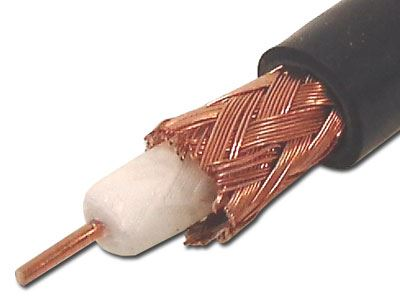
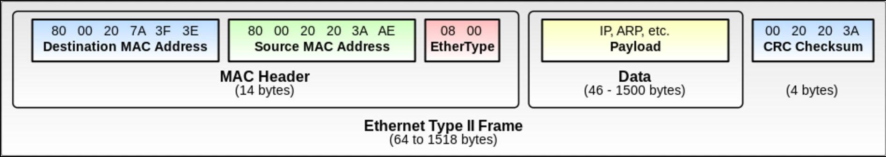
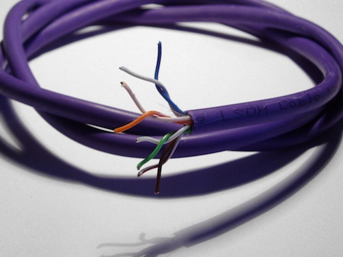
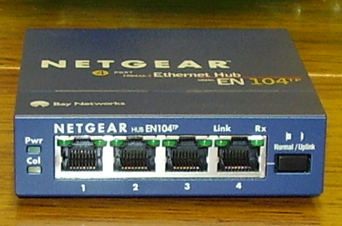
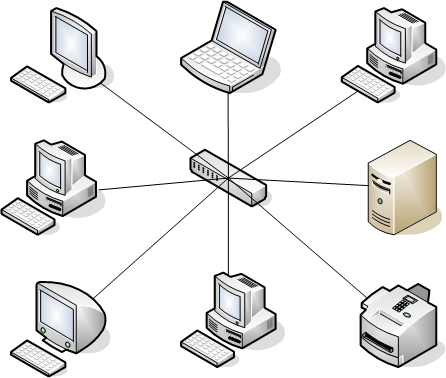

# Meta
- Welcome to Computer Networking Brain Dump
- We'll meet once a week
- I'll cover fundamentals, history, basics
- Not meant to teach tools but I'll mention them as we go
- I'll try to suggest things to try at home

---

# Birth of the Ethernet
- Scientists at PARC wanted a simple way to connect computers together
- Decided to hook up computers to a single piece of coax wire
- Early on, connectors just punched a hole to get to the core
- Each host has an "Ethernet adaptor" / NIC
- 10 megabits per second (10BASE5 & 10BASE2)

---

# Ethernet basics
- With single wire signal travels to everyone -- shared medium
- Great for one computer talking to all -- broadcast
- But most comms are point-to-point
- Only one host can "talk" at any one instant

---

# Carrier Sense
- Two hosts can't talk at the same time -- will garble each other
- But there's nothing to synchronize the hosts
- Host wishing to trasmit:
  - Waits for the line to go quiet
  - Starts transmitting and listens
  - If it detects interference
    - Stops transmitting
    - Waits random amount of time
    - Tries again

---

# Packets
- Each host can only transmit a little bit at a time
- Avoids hogging the line problem
- Each Ethernet Frame can fit 1500 bytes max (MTU)

---

# Need for addressing
- How do you talk to only a single host?
- Assign each host an address
- Include destination address in each packet
- NIC filters out packets not destined to it

---

# MAC addresses
- 6 byte address
- Lower 3 bytes are device manufacturer (OUI)
  - Assigned by IEEE
- Upper 3 bytes are assigned by manufacturer (NIC)
- Originally burned into hardware

---

# Ethernet Frame

---

# Types of addresses
- Unicast: bbbb:bbb0-XX-XX-XX-XX-XX
- Broadcast: FF-FF-FF-FF-FF-FF
  - NIC does not filter out
- Multicast: bbbb:bbb1-XX-XX-XX-XX-XX
  - Each address is a "topic"
  - NIC does not filter out
  - Special handling of specific "topics"

---

# Beyond coax
- Coax is costly and inflexible
    - Replaced by twisted pair (10BASE-T)
- Twisted pair has smaller range
    - Rise of star topology
    - Twisted pair plugged into a hub

---

