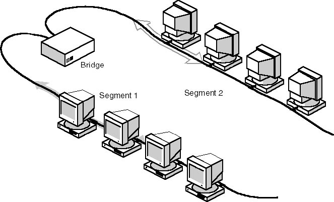

# Networking Brain Dump

### Episode 2: Towards modern Ethernet

---
# Last time on NBD...
- Ethernet on shared medium
- MAC Addresses: unicast, multicast, broadcast
- Twisted pair and hubs

---
# Two worlds united
- Consider an org with R&D and QA depts
- Each has their own network segment
- Want to work together
- How do you join their networks?

---
# Can they splice?
- Connect coax ends together
  - Or connect hubs
- Problems:
  - Cable length limits
    - Can be cured with repeaters
  - Shared medium not designed for lots of hosts

---
# Better solution
- Put an intelligent "bridge" device

---
# Ethernet bridge
- Has 2 ports: A and B
- Multicast packets are always passed between ports
- Remembers source addresess and port it has seen
- Only forwards unicast to other port if not local

---
# Let's make it bigger
- What if Accounting wants to join the party?
- Same idea, need 3 ports

---
# Ethernet switch
- A bridge with lots of ports (e.g. 24)
- Each segment is reduced to a single host
- Learns MAC-port mapping
  - Listen / flood
- No more collisions

---
# Multiple bridges
- Switch has limited number of ports
- You can plug one switch into another
  - Creates different topologies
- Example topology: tree

---
# Watch out for loops
- Switches form a loop?
- Multicast packets forwarded forever!
- But unicasts floods will also loop!

---
# Loop elimination
- Track down all loop causing links and disable them
- Should produce a spanning-tree
- Can't just use Kruskal's or Prim's algo

---
# Spanning Tree Protocol (STP)
- Step 1: Elect a root
  - Lowest Priority:MAC wins
- Step 2: Find ports on path to root
  - Root ports and designated ports
- Step 3: Block the rest
  - Remainging ports are blocked

---
# Spanning Tree Protocol (STP)
- STP sends BPDU packets between switches
  - Sent on 01:80:C2:00:00:00 multicast adderss
- Requires switch ports to have MAC addresses

---
# Algoryhme by Radia Perlman
<pre>
I think that I shall never see
A graph more lovely than a tree.
A tree whose crucial property
Is loop-free connectivity.
A tree that must be sure to span
So packets can reach every LAN.
First, the root must be selected.
By ID, it is elected.
Least-cost paths from root are traced.
In the tree, these paths are placed.
A mesh is made by folks like me,
Then bridges find a spanning tree.
</pre>

---
# STP limitations
- Can't use redudant links for load balancing
- Topology changes take 30+ secs

---
# STP successors
- Rapid STP
- Spanning Tree Bridging (STB)
- TRILL
- L3 switching
