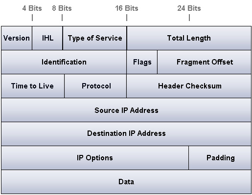
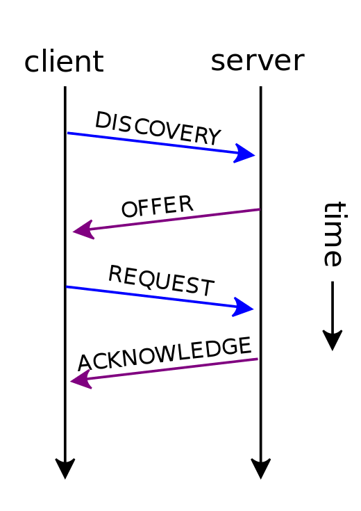

# Networking Brain Dump

### Episode 3: Internet Protocol

---
# Last time on NBD...
- Ethernet on shared medium
- Switched ethernet
  - Everyone talking!

---
# Connect the world
- Let's add _more_ hosts to Ethernet!
  - What happens?

---
# Need more structure
- Sending a letter
  - Small room: shout
  - Whole country: zip codes

---
# Internet Protocol (IP)
- Analogous to a postal system
- Every host on the network has an IP address
- Hosts close together have nearby IPs
- Forward via gateways

---
# IP address
- Example: 66.12.121.2
- 4 octets: xxx.xxx.xxx.xxx
- Each octet/quad is 0-255
- Unique to a host\*

---
# IP Header

---
# IP address format
- Network and Host portion
- 66.12.121.2
  - Network: 66.12
  - Host: 121.2

---
# CIDR format
- Network and Host separator
  - Count the number of bits in Network
  - Append it after the slash
- 66.12.121.2/16
- Can also write it as a bit-mask
  - 255.255.0.0

---
# Routing (1)
- Host sending to 66.12.121.2/16
- Same network?
  - Yes: Shout!
  - No: Send to Gateway

---
# Routing (2)
- Gateway is a router
- Router consults a routing table:

| Prefix     | Next-hop | Port |
|-------------------------------|
| 66.0.0.0/8 | 66.1.1.1 | port0 |
| 75.0.0.0/8 | 75.2.1.1 | port1 |
| 66.8.0.0/9 | 66.1.2.2 | port0 |
| 0.0.0.0/0  | 80.1.2.1 | port2 |

- Forwards the packet to next-hop

---
# Routing (3)
- Packet forwarded onto destination
- Router on destination network shouts

---
# How do you shout?
- Final step: use Ethernet unicast
- But first map IP to MAC address

---
# Special Address: Broadcast
- 255.255.255.255
- 66.12.255.255/16
- Mapped to Ethernet broadcast (FF:FF:FF:FF:FF:FF)

---
# Address Resolution Protocol (ARP)
- Uses Ethernet broadcast
  - Asks "Who is 66.12.121.2"?
- Matching host unicasts the response 
  - Answer: "66.12.121.2 is at 0A:45:67:89:0B:FE"
- Mapping cached in an ARP table

---
# Using IP locally
- Also used on a LAN
- No routing needed, why?
  - Uniformity

---
# IP space is limited
- O(2^32) addresses and running out fast!
- If LAN only use, don't need global IP

---
# Private IPs: RFC1918
- IANA reserved these ranges:
  - 10.0.0.0/8
  - 172.16.0.0/12
  - 192.168.0.0/16
- Can be routed within an org
- Don't route on the Internet

---
# IP Assignment
- How to assign a unique IP to a host?
- Could do it manually -- tedious
- Automatically via a helper protocol

---
# Dynamic Host Configuration Protocol (DHCP)
- Based on older BOOTP
- Host broadcasts request to get an IP
- DHCP server:
  - Picks an available IP from a range
  - Unicasts it back to the host

---
# DHCP

---
# Link-local Addressing
- We don't always need DHCP
- What if we only use an IP on a single Ethernet segment?
- IANA reserved 169.254.0.0/16
- Two step process:
  - Pick an address in that range
  - ARP (who-is) to check for conflict
- Link-locals are _never_ routed

---
# Special Address: Loopback
- Refer to "this host"
- 127.0.0.0/8 
- 127.0.0.1 is customary

---
# Tools, tools, tools!
- ifconfig, ip addr
- ip route, netstat -rn
- Wireshark
