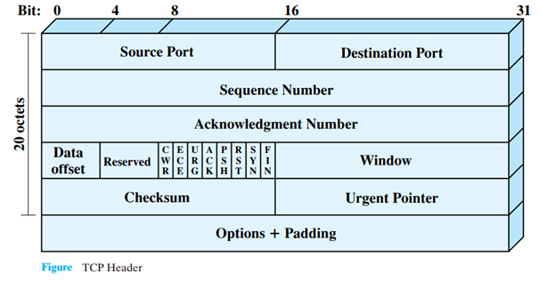

# Networking Brain Dump

### Episode 5: UDP and TCP

---
# Last time on NBD...
- IP routes segments to destination
- Uses helpers
  - Routing protocols
  - ICMP

---
# What IP *does* not do
- address a process on a machine
- provide data integrity
- protect against dropped segments
- help avoid dropped segments
  - flow control
  - congestion avoidance

---
# User Datagram Protocol (UDP)
- Process addressability
- Data integrity

---
# Process addressability
- Is the packet for HTTP or mail server?
- Process is addressed via a *port*
- Port is a 16-bit number
- Both source and destination port

---
# Well known vs ephemeral ports
- Well known:
  - Program specifies
  - Assigned by IANA
  - Lower range
- Ephemeral:
  - Chosen by OS
  - Usually used for source ports

---
# Integrity
- Achieved via a checksum
- 16-bit one's complement sum
- Sums up:
  - IP pseudo header
  - UDP header
  - UDP payload

---
# UDP Header

---
# Transmission Control Protocol (TCP)
- Ports and checksum as in UDP
- Connection based
- Byte stream
- Reliable

---
# Reliable byte stream
- Client connects to server
- Sends arbitrary number of bytes
- TCP breaks up stream into packets
- Reassembles on the other end

---
# Sequence numbers
- TCP is bi-directional
- Need a pair of seq numbers
- Used for:
  - Ordering
  - Gap detection
  - Retransmission

---
# TCP Header

---
# Synchronizing seq nums
- Client:
  - picks a random seq-num
  - sends it in a SYN-packet
- Server:
  - picks a random seq-num
  - sends it in a SYN-packet
  - also ACKs client's seq-num
- Client
  - ACKs server's seq-num

---
# TX: Sender...
- Puts its seq-num into TCP header
- Increments its seq-num by bytes sent

---
# RX: Receiver...
- Compares seq-num in TCP header to next expected
- If it matches
 - Increments next expected by payload length
 - ACK expected seq-num
- If too old
  - Discards
- If not too new
  - Buffers and waits for gap fill
  - Still sends an ACK

---
# Retransmission
- The need is detected by one of:
  - ACK timeout (RTO = SRTT + 4 * RTTV)
  - 3 future ACKs (Fast Retransmit)
  - Selective ACK (SACK)

---
# Retransmit buffer
- Can't discard TX'ed packets until ACK'ed
- *Q*: How big should the buffer be?
- *A*: As big as the pipe

---
# Bandwidth-delay product
- BDP = Bandwidth x RTT
- Tuning is important:
  - Too small -- underutilization
  - Too big -- memory waste
- RTT is easy to measure
- But bandwidth not so much :(
