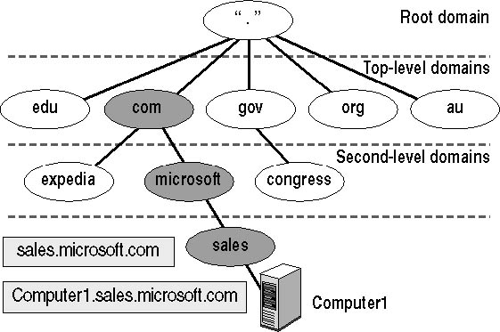

# Networking Brain Dump

### Episode 7: DNS

---
# Last time on NBD...
- TCP
  - Flow control
  - Congestion control

---
# Trouble with IP addresses
- Hard to remember
- Change often
- Need symbolic names

---
# HOSTS.TXT
- In the early days of the Internet
- Periodically downloaded
- Updated by phone

---
# HOSTS.TXT excerpt
```
HOST : 18.26.0.1 : MIT-CHARMIN,CHARMIN : IMAGEN : IMAGEN : IP :
HOST : 18.58.0.1 : MIT-ATHENA,ATHENA : VAX-11/750 : UNIX : TCP/TELNET,TCP/FTP,TCP/SMTP,UDP :
HOST : 18.27.0.2 : MIT-CEZANNE,CEZANNE : VAX-11/750 : UNIX : TCP/TELNET,TCP/FTP,TCP/SMTP,TCP/TIME,TCP/DAYTIME :
HOST : 18.58.0.2 : MIT-ZEUS,ZEUS : VAX-11/750 : UNIX : TCP/TELNET,TCP/FTP,TCP/SMTP,UDP :
HOST : 18.27.0.3 : MIT-DEGAS,DEGAS : VAX-11/750 : UNIX : TCP/TELNET,TCP/FTP,TCP/SMTP,TCP/TIME,TCP/DAYTIME :
HOST : 18.58.0.3 : MIT-HERA,HERA : VAX-11/750 : UNIX : TCP/TELNET,TCP/FTP,TCP/SMTP,UDP :
HOST : 18.58.0.4 : MIT-DEMETER,DEMETER : VAX-11/750 : UNIX : TCP/TELNET,TCP/FTP,TCP/SMTP,UDP :
HOST : 18.58.0.5 : MIT-ARES,ARES : VAX-11/750 : UNIX : TCP/TELNET,TCP/FTP,TCP/SMTP,UDP :
```

---
# Domain Name System (DNS)
- HOSTS.TXT is not scalable
- Need a distributed database

---
# Domain Namespace
- Domain Namespace
  - Hierarchical
  - `www.google.com.`
  - Root is empty string

- Subdomain
  - Any sub-tree
  - E.g. `www.google.com` and `eng.blog.google.com`
    - `www` and `eng.blog` are subdomains of `google.com`

---
# Domain Namespace


---
# Key-value DB
- Key is the domain name and TYPE
  - TYPE (e.g. A, NS, MX)

- Value
  - RDATA (type specific)
  - TTL (validity in secs)

- Key/Value is a Resource Record (RR)

---
# Resource Record types
- `A` (IPv4 address)
- `AAAA` (IPv6 address)
- `MX` (Mail exchange)
- `CNAME` (Alias)
- `NS`, `SOA` (more on this later)

---
# A Record Example
```
$ dig google.com

; <<>> DiG 9.8.3-P1 <<>> google.com
;; global options: +cmd
;; Got answer:
;; ->>HEADER<<- opcode: QUERY, status: NOERROR, id: 28155
;; flags: qr rd ra; QUERY: 1, ANSWER: 1, AUTHORITY: 0, ADDITIONAL: 0

;; QUESTION SECTION:
;google.com.            IN    A

;; ANSWER SECTION:
google.com.        238    IN    A    216.58.194.206
```
---
# MX Record Example
```
$ dig MX lyft.com

; <<>> DiG 9.8.3-P1 <<>> MX lyft.com
;; global options: +cmd
;; Got answer:
;; ->>HEADER<<- opcode: QUERY, status: NOERROR, id: 46361
;; flags: qr rd ra; QUERY: 1, ANSWER: 5, AUTHORITY: 0, ADDITIONAL: 0

;; QUESTION SECTION:
;lyft.com.            IN    MX

;; ANSWER SECTION:
lyft.com.        134    IN    MX    1 aspmx.l.google.com.
lyft.com.        134    IN    MX    10 aspmx2.googlemail.com.
lyft.com.        134    IN    MX    10 aspmx3.googlemail.com.
lyft.com.        134    IN    MX    5 alt1.aspmx.l.google.com.
lyft.com.        134    IN    MX    5 alt2.aspmx.l.google.com.
```

---
# DNS Name Servers
- Nodes in distributed database
- Given a key, return the value
- Responsible for a portion of the namespace

---
# Zones
- Contiguous portion of the domain name space
- Administered by a single organization
- E.g.: `.com` and `google.com`

---
# Authoritative Name Server
- Name server responsible for a zone
- Can be located with an NS record

```
$ dig NS lyft.com

; <<>> DiG 9.8.3-P1 <<>> NS lyft.com
;; global options: +cmd
;; Got answer:
;; ->>HEADER<<- opcode: QUERY, status: NOERROR, id: 40182
;; flags: qr rd ra; QUERY: 1, ANSWER: 4, AUTHORITY: 0, ADDITIONAL: 0

;; QUESTION SECTION:
;lyft.com.            IN    NS

;; ANSWER SECTION:
lyft.com.        3871    IN    NS    ns-1254.awsdns-28.org.
lyft.com.        3871    IN    NS    ns-973.awsdns-57.net.
lyft.com.        3871    IN    NS    ns-1656.awsdns-15.co.uk.
lyft.com.        3871    IN    NS    ns-288.awsdns-36.com.
```

---
# Recursive Name Server
- Resolves the request
- Performs multiple steps
- Caches responses
- Used by the client (resolver)

---
# Recursive Query Handling
- Do cache lookup for best match (NS type)
  - Suffix search
- Send query to NS
- Walk the referrals
- Cache responses

---
# Resolving `blog.lyft.com`
```
$ dig +trace blog.lyft.com

; <<>> DiG 9.8.3-P1 <<>> +trace blog.lyft.com
;; global options: +cmd
.            205206    IN    NS    k.root-servers.net.
.            205206    IN    NS    h.root-servers.net.
;; Received 228 bytes from 10.100.129.10#53(10.100.129.10) in 120 ms

com.            172800    IN    NS    j.gtld-servers.net.
com.            172800    IN    NS    f.gtld-servers.net.
;; Received 491 bytes from 193.0.14.129#53(193.0.14.129) in 126 ms

lyft.com.        172800    IN    NS    ns-288.awsdns-36.com.
lyft.com.        172800    IN    NS    ns-973.awsdns-57.net.
;; Received 200 bytes from 192.31.80.30#53(192.31.80.30) in 30 ms

blog.lyft.com.        300    IN    CNAME    ext-cust.squarespace.com.
lyft.com.        172800    IN    NS    ns-1254.awsdns-28.org.
lyft.com.        172800    IN    NS    ns-1656.awsdns-15.co.uk.
;; Received 203 bytes from 205.251.198.120#53(205.251.198.120) in 53 ms
```

---
# Caching
- Above would be too slow to do each time
- RR are cached according to TTL
- Greatly reduces number of queries

---
# Glue Records
- But we have a chicken and egg problem
- How do you get IP for `ns2.google.com`?
- Answer: Glue Records
  - `.com. NS` query also returns `ns2.google.com. A` record!

---
# Glue Record: example
```
$ dig @j.gtld-servers.net. blog.lyft.com +norecurse

; <<>> DiG 9.8.3-P1 <<>> @j.gtld-servers.net. blog.lyft.com +norecurse
; (1 server found)
;; global options: +cmd
;; Got answer:
;; ->>HEADER<<- opcode: QUERY, status: NOERROR, id: 41416
;; flags: qr; QUERY: 1, ANSWER: 0, AUTHORITY: 4, ADDITIONAL: 2

;; QUESTION SECTION:
;blog.lyft.com.            IN    A

;; AUTHORITY SECTION:
lyft.com.        172800    IN    NS    ns-288.awsdns-36.com.
lyft.com.        172800    IN    NS    ns-973.awsdns-57.net.
lyft.com.        172800    IN    NS    ns-1656.awsdns-15.co.uk.
lyft.com.        172800    IN    NS    ns-1254.awsdns-28.org.

;; ADDITIONAL SECTION:
ns-288.awsdns-36.com.    172800    IN    A    205.251.193.32
ns-973.awsdns-57.net.    172800    IN    A    205.251.195.205
```
