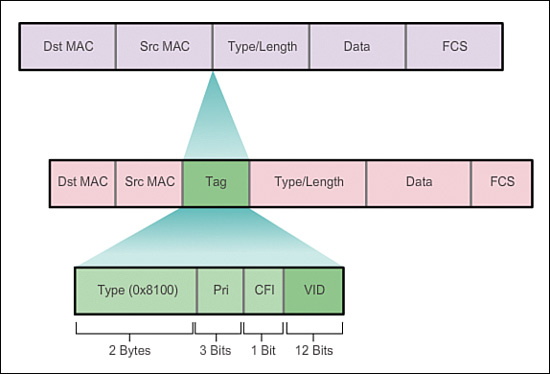
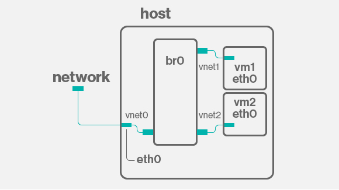
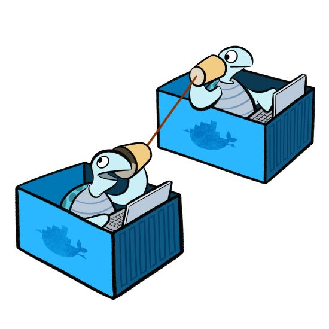
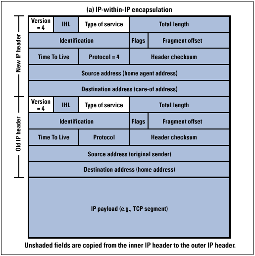

# Networking Brain Dump

### Episode 8: SDN

---
# Last time on NBD...
- DNS
  - How google.com becomes 172.217.6.46
- Finished TCP/IP suite

---
# The cloud era
- VMs present unique challenges
- We considered 1 host : 1 MAC : 1 IP
- Many VMs per host
  - Each VM wants an IP
- VMs are transient and mobile
- Network needs virtualization

---
# Before SDNs: VLAN (802.1Q) (circa 2000)

---
# Software switches
- Recall that a switch:
  - Learns by flooding
  - Maitains forwarding database
- Easy to do in software
- Usually done in the kernel

---
# Linux's switches
- "Native" bridge
- OpenVSwitch
- Both can also do L3

---
# Virtual bridging

---
# Virtual bridging
- Pros:
  - Straightforward setup
  - Low overhead
  - VMs are on "native" network
- Cons:
  - Large broadcast domain
  - Impacts the rest of the network
  - Not multi-tenant friendly

---
# Virtual bridging variant
- MACVLAN
  - Assign multiple MACs to a NIC

---
# Virtual routing
- Linux bridge can be given an IP (make it a GW)
- Linux kernel does the routing and NAT

---
# Docker Example

---
# Docker Example

---
# Docker Example
- Container net on each host
- Routed through the host with IP Masq to outside

---
# Overlay networks
- A layer of indirection
- Mesh of point-to-point tunnels

---
# Tunneling
- Take a packet with it's headers
  - Starting with MAC or IP
- Put it as payload of another packet
  - Payload of MAC/IP/UDP

---
# Example: IPIP tunneling

---
# Lots of tunnels
- IPIP
- SIT
- GRE
- NVGRE
- VXLAN

---
# Mesh networking
- For each cluster member
  - Create a tunnel to all other members
  - That's the data plane
- The challenge is management (members change!)
  - Control plane

---
# VXLAN
- Very popular today
- Wraps L2 in L4 (UDP)
- Hash its own header
  - Contains 24-bit VNID (tenant ID)
- High overhead

---
# VXLAN

---
# Overlay networks
- Easier and harder to manage
- Size overhead (reduced MTU)
- Control plane is crucial

---
# Overlay network systems
- Weave
- Calico
- flannel
- OpenContrail
- OpenStack
- Docker

---
# Overlay network control plane
- Database
  - Cassandra
  - Zookeeper
  - etcd
  - Consul
  - MySQL
- Gossip protocols
  - Seeded with a peer
- Agent on each host

---
# Thank you for listening

